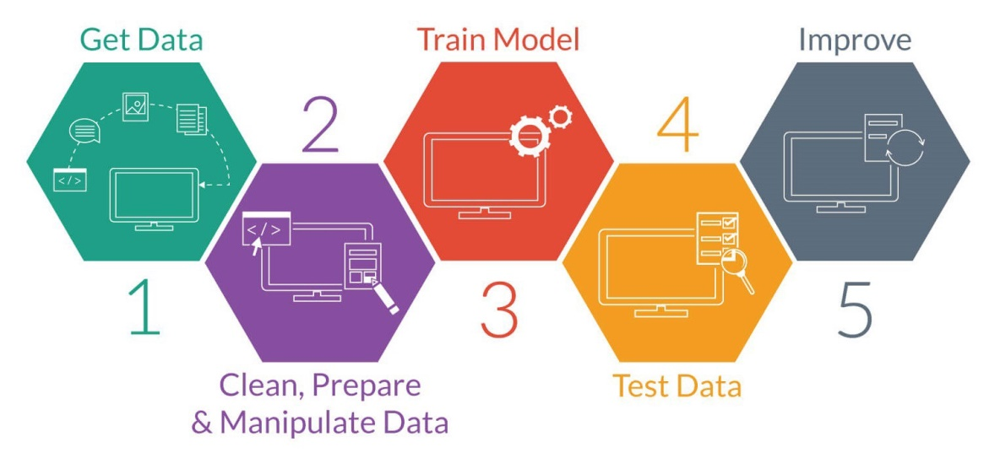
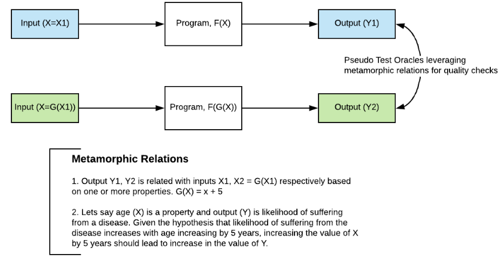
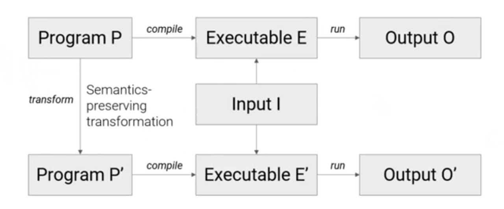

# Metamorphic Testing for Validation of ML/DL Models 
## The problem
Find the suitable ways to solve the test Oracle problem [1] in AI/ML/DL
software (in a simple way find an approach to an end to end functional testing
for AI which considered as a non-testable system).
## Introduction
### The Test Oracle
In software testing, Test oracle is a mechanism that can tell you whether a
program is working correctly or not. For the simplest case, an oracle could be a
direct comparison of the output of the program with the correct answer.

Test oracle can provides a mean to (1) Generate expected results for test inputs
(2) Compare the expected and actual results of execution of the implementation
under test (IUT) [2].

Test oracle has different types Perfect Oracle, Gold standard Oracle, Parametric
Oracle, Statistical Oracle, etc… the most common is the statistical Oracle (a
type of parametric oracle).

### The ML System Under Test

Testing machine learning and AI algorithms is hard [3] as scientific software
differs significantly from the development of more traditional business
information systems, these differences appear throughout the following stages of
the software lifecycle: requirement, design, coding, validation and
verification, and deployment.

Moreover, the problem is that often there is no oracle without human
intervention, e.g., image recognition solved by supervised ML. This usually
begins by curating a dataset of correctly labelled image for training and
validating, which is itself a way of introducing an oracle for the software
model in development by human intervention. This implies that the range of test
conducted to the model will be limited by human efforts, and expanding the test
cases, for example increasing the sampling size and varieties significantly with
online testing, would be a problem.

Pseudo-oracle and metamorphic testing [4], means that we can have multiple
implementations solving the same problem verifying each other. The outputs of
all implementations are compared, and if one of them is different, it could
indicate that the algorithm has some faults in it [5].

### Metamorphic Testing
A software testing technique that can effectively address two fundamental problems in software testing: the **oracle problem** and **automated test case generation problem**. The main difference between MT and regular testing techniques is that MT does not focus on the verification of each componant of  the software under test (and therefore can be performed in the absence of an oracle). MT checks the relations among the inputs and outputs of multiple executions of the software. Such relations are called metamorphic relations (MRs) [6].

## MT In ACtion

### Metamorphic Testing of Navigation Software: A Pilot Study with Google Maps [7]

------------------------------
http://slides.com/karfianto/software-testing-and-analysis#/7
------------------------------

## Conclusion

Using pseudo-oracles or metamorphic testing reduces testing effort and enables
bug to be found that might otherwise be overlooked.

[1]: Elaine J. Weyuker, On Testing Non-Testable Programs, The Computer Journal, Volume 25, Issue 4, November 1982, Pages 465–470, https://doi.org/10.1093/comjnl/25.4.465.

[2]: Kshirasagar Naik and Priyadarshi Tripathy. 2018. Software Testing and Quality Assurance: Theory and Practice (2nd ed.). Wiley Publishing.

[3]: J. Carver, N. P. C. Hong, and G. K. Thiruvathukal, Eds., Software engineering for science. Boca Raton: Taylor & Francis, CRC Press, 2017.

[4]: T. Y. Chen, S. C. Cheung, and S. M. Yiu, “Metamorphic testing: a new approach for generating next test cases,” Technical Report HKUST-CS98–01, Department of Computer Science, Hong Kong University of Science and Technology, Hong Kong, 1998.

[5]: Giannoulatou, E., Park, S. H., Humphreys, D. T., & Ho, J. W. (). Verification and validation of bioinformatics software without a gold standard: a case study of BWA and Bowtie. BMC bioinformatics, 15 Suppl 16(Suppl 16), S15. doi:10.1186/1471-2105-15-S16-S15

[6] Tsong Yueh Chen, Fei-Ching Kuo, Huai Liu, Pak-Lok Poon, Dave Towey, T. H. Tse, and Zhi Quan Zhou. 2018. Metamorphic testing: A review of challenges and opportunities. ACM Computing Surveys 51, 1 (2018), 4:1–4:27.

[7] Joshua Brown, Zhi Quan Zhou, and Yang-Wai Chow. 2018. Metamorphic testing of navigation software: A pilot study with Google Maps. In Proceedings of the 51st Annual Hawaii International Conference on System Sciences (HICSS-51). 5687–5696. Available: http://hdl.handle.net/10125/50602.
