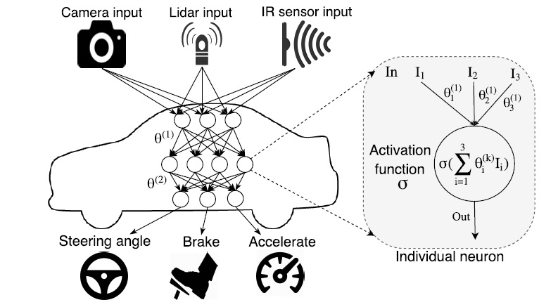
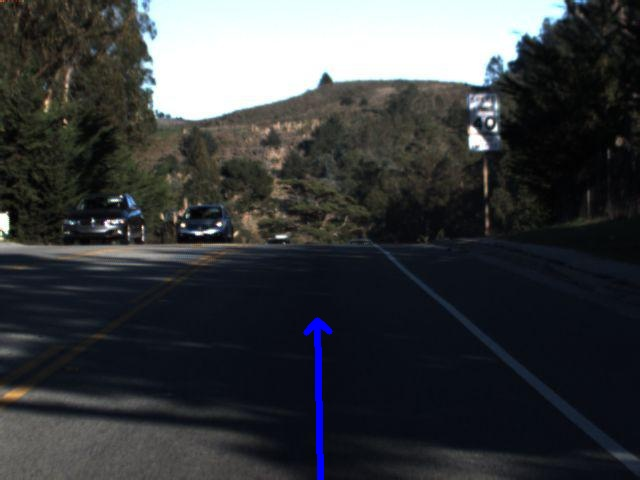
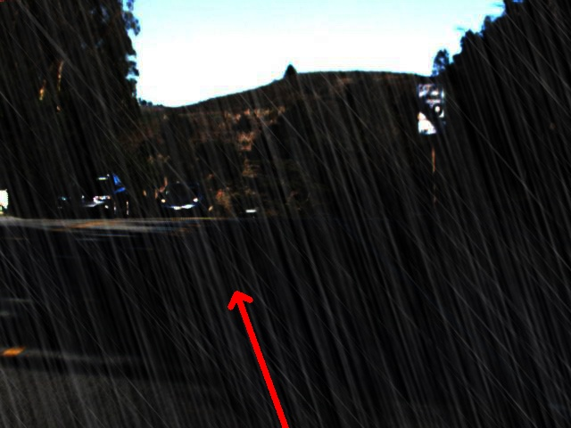

# Metamorphic Testing for Validation of ML/DL Models 
## The problem
Find the suitable ways to solve the test Oracle problem [1] in AI/ML/DL
software (in a simple way find an approach to an end to end functional testing
for AI which considered as a non-testable system).
## Introduction
### The Test Oracle
In software testing, Test oracle is a mechanism that can tell you whether a
program is working correctly or not. For the simplest case, an oracle could be a
direct comparison of the output of the program with the correct answer.

Test oracle can provides a mean to (1) Generate expected results for test inputs
(2) Compare the expected and actual results of execution of the implementation
under test (IUT) [2].

Test oracle has different types Perfect Oracle, Gold standard Oracle, Parametric
Oracle, Statistical Oracle, etc… the most common is the statistical Oracle (a
type of parametric oracle).

### The ML System Under Test

Testing machine learning and AI algorithms is hard [3] as scientific software
differs significantly from the development of more traditional business
information systems, these differences appear throughout the following stages of
the software lifecycle: requirement, design, coding, validation and
verification, and deployment.

Moreover, the problem is that often there is no oracle without human
intervention, e.g., image recognition solved by supervised ML. This usually
begins by curating a dataset of correctly labelled image for training and
validating, which is itself a way of introducing an oracle for the software
model in development by human intervention. This implies that the range of test
conducted to the model will be limited by human efforts, and expanding the test
cases, for example increasing the sampling size and varieties significantly with
online testing, would be a problem.

The key component of an autonomous vehicle is the perception module controlled by the underlying Deep Neural Network (DNN), the network takes input from different sensors like camera, light detection and ranging sensor (LiDAR), and IR (infrared) sensor that measure the environment and outputs the steering angle, braking, etc. necessary to maneuver the car safely under different
conditions.

The main idea is to develop an automated testing methodology for driven autonomous cars
-   How do we systematically explore the input-output spaces of an autonomous
    car DNN?
-   How can we synthesize realistic inputs to automate such exploration?
-   How can we optimize the exploration process?
-   How do we automatically create a test oracle that can detect erroneous
    behaviors without detailed manual specifications?

### Metamorphic Testing
A software testing technique that can effectively address two fundamental problems in software testing: the **oracle problem** and **automated test case generation problem**. The main difference between MT and regular testing techniques is that MT does not focus on the verification of each componant of  the software under test (and therefore can be performed in the absence of an oracle). MT checks the relations among the inputs and outputs of multiple executions of the software. Such relations are called metamorphic relations (MRs) [6].

## MT In Action 

### Systematic Testing with Neuron Coverage (The Testing Technique)

The combination of all possible inputs and outputs for autonomous car
exploratory analysis is very large so there must be a way for partitioning the
space into different equivalence classes and choosing the right equivalent
representatives is done by *neuron coverage (for measuring how many rules in a
DNN are exercised by a set of inputs), this way is dependent on the s*

*Neuron Coverage = Number of activated Neurons/Total number of Neurons*

### Image Augmentations (Automated Test Case Generation)

Arbitrary inputs that maximize neuron coverage is inefficient way in deep
learning models, in stead generating realistic synthetic images by applying
image transformations on seed images and mimicking different real-world
phenomena like camera lens distortions, object movements, different weather
conditions (rain, fog, etc…) is a more efficient way for increasing test
coverage. The image generation is done by a greedy search algorithm in [8].

### Creating a Test Oracle with Metamorphic Relations

Here is where metamorphic relations [4] between the car behaviors across
different synthetic images come to play a role. The key insight is that even
though it is hard to specify the correct behavior of a self-driving car for
every transformed image, one can define relationships between the car’s
behaviors across certain types of transformations. For example, the autonomous
car’s steering angle should not change significantly for the same image under
any lighting/weather conditions, blurring, or any affine transformations with
small parameter values.

### Violations (sample bugs) --- chauffeur model 
#### original

#### rain

## Conclusion

Using pseudo-oracles or metamorphic testing reduces testing effort and enables
bug to be found that might otherwise be overlooked.

[1]: Elaine J. Weyuker, On Testing Non-Testable Programs, The Computer Journal, Volume 25, Issue 4, November 1982, Pages 465–470, https://doi.org/10.1093/comjnl/25.4.465.

[2]: Kshirasagar Naik and Priyadarshi Tripathy. 2018. Software Testing and Quality Assurance: Theory and Practice (2nd ed.). Wiley Publishing.

[3]: J. Carver, N. P. C. Hong, and G. K. Thiruvathukal, Eds., Software engineering for science. Boca Raton: Taylor & Francis, CRC Press, 2017.

[4]: T. Y. Chen, S. C. Cheung, and S. M. Yiu, “Metamorphic testing: a new approach for generating next test cases,” Technical Report HKUST-CS98–01, Department of Computer Science, Hong Kong University of Science and Technology, Hong Kong, 1998.

[5]: Giannoulatou, E., Park, S. H., Humphreys, D. T., & Ho, J. W. (). Verification and validation of bioinformatics software without a gold standard: a case study of BWA and Bowtie. BMC bioinformatics, 15 Suppl 16(Suppl 16), S15. doi:10.1186/1471-2105-15-S16-S15

[6] Tsong Yueh Chen, Fei-Ching Kuo, Huai Liu, Pak-Lok Poon, Dave Towey, T. H. Tse, and Zhi Quan Zhou. 2018. Metamorphic testing: A review of challenges and opportunities. ACM Computing Surveys 51, 1 (2018), 4:1–4:27.

[7] Joshua Brown, Zhi Quan Zhou, and Yang-Wai Chow. 2018. Metamorphic testing of navigation software: A pilot study with Google Maps. In Proceedings of the 51st Annual Hawaii International Conference on System Sciences (HICSS-51). 5687–5696. Available: http://hdl.handle.net/10125/50602.

[8] https://arxiv.org/abs/1708.08559
